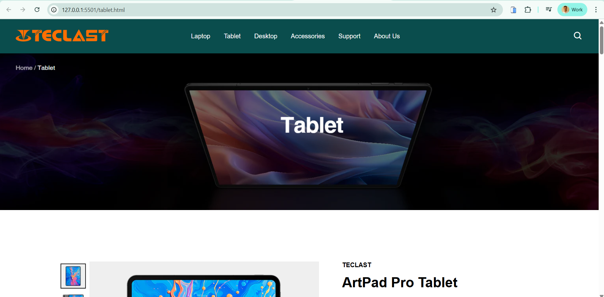

# heading one
# heading two
# heading three
# heading four

## Project Name
## Tect format

**text is bold**
*Italic tect here*
  Delete text

## List
- header 
- table
- navigation
    - other
    - other 
---
1. one
2. two
3. three 
    1. other
    2. other


## Table 

| id | name | age | phone |
|----|------|-----|-------|
| 01 | Phalla | 016 | 12345 |
| 02 | Makara | 017 | 12347 |
| 03 | Sokny | 018 | 12346 |


## Block quote 
> npm install

> composer install

> pip install

## Code online
`print("hello word")`

`npm install exprees`

## Code multiple line
```html
<h1> Hello word </h1>
<p>This is our Website that you can use what and when -ever you want.</p>
```
```python
for i in range (10):
    print(i)
```
```css
nav {
    display: flex;
    justify-content:center;
}
```
## Check list
- [x] Laptop page
- [x] Tablet page
- [x] Desktop page
- [x] Accesseries page
- [x] Support page
- [x] About us page

### Link

<!-- CSS framework [Tailwindcss](https://www.youtube.com/) -->

## Tablet page


## About us page


### Thanks for supporting our Website.